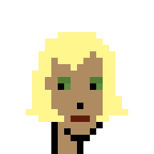
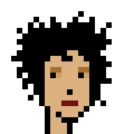

# artbase - zero-config web server / services; (auto-)downloads & serves pre-configured pixel art collections "out-of-the-box"; incl. 2x/4x/8x zoom for bigger image sizes and more; xcopy binaries for easy installation


## Build & Run From Source


Use

```
$ go build artbase.go
```

to get a zero-config x-copy binary for your operation system / architecture.
To run use:

```
$ artbase
```

This will start-up a (web) server (listening on port 8080).


## Artbase - The Server Edition

The artbase (web) server will (auto-)download on demand the first-time only pre-configured
pixel art collections (using all-in-one image composites)
to your working directory and use the "cached" version from the next time on (incl. server restarts).


The pixel art collections pre-configured include:

- [punks](https://github.com/cryptopunksnotdead/awesome-24px/blob/master/collection/punks.png) (24x24)
- [morepunks](https://github.com/cryptopunksnotdead/awesome-24px/blob/master/collection/morepunks.png) (24x24)
- [readymadepunks](https://github.com/cryptopunksnotdead/punks.readymade/raw/master/readymades.png) (24x24)
- [coolcats](https://github.com/cryptopunksnotdead/awesome-24px/blob/master/collection/coolcats.png)  (24x24)
- [boredapes](https://github.com/cryptopunksnotdead/awesome-24px/blob/master/collection/boredapes.png)  (28x28)
- And more


### (Web) Services


To get pixel art images, use `/:name/:id`. Example:


`/punks/0`, `/punks/1`, `/punks/2`, ...


or `/coolcats/0`, `/coolcats/1`, `/coolcats/2`, ...


#### z (zoom) Parameter - 2x, 4x, 8x, 10x, 20x ...


Note: The default image size is the default
(minimum) pixel size of the collection e.g. 24x24 for punks, morepunks,
coolcats and so on.
Use the z (zoom) parameter to upsize.

Let's try 2x:


`/punks/0?z=2`, `/punks/1?z=2`, `/punks/2?z=2`, ...


or `/coolcats/0?z=2`, `/coolcats/1?z=2`, `/coolcats/2?z=2`, ...


Let's try 8x:


`/punks/0?z=8`, `/punks/1?z=8`, `/punks/2?z=8`, ...






or `/coolcats/0?z=8`, `/coolcats/1?z=8`, `/coolcats/2?z=8`, ...  And so on.


#### bg (background) Parameter

Let's try adding the classic gray-ish/blue-ish v2 background
in red/green/blue (rgb) hexcode `#638596`.
Use the bg (background) parameter:

`/punks/0?bg=638596`, `/punks/1?bg=638596`, `/punks/2?bg=638596`, ...

.png)
.png)
.png)


Let's try adding the baby blue-ish v3 background
in red/green/blue (rgb) hexcode `#60a4f7`:

`/punks/0?bg=60a4f7`, `/punks/1?bg=60a4f7`, `/punks/2?bg=60a4f7`, ...

.png)
.png)
.png)


####  Bonus  -  Philip! Phree the Phunks!

Let's try to flip vertically, that is, mirror, the images -
that turns right-looking images into left-looking and vice versa.
Use the m (mirror) parameter:


`/punks/0?m=t`, `/punks/1?m=t`, `/punks/2?m=t`, ...


That's it for now.


## License

The `artbase` sources & binaries are dedicated to the public domain.
Use it as you please with no restrictions whatsoever.


## Questions? Comments?

Post them on the [CryptoPunksDev reddit](https://old.reddit.com/r/CryptoPunksDev). Thanks.

